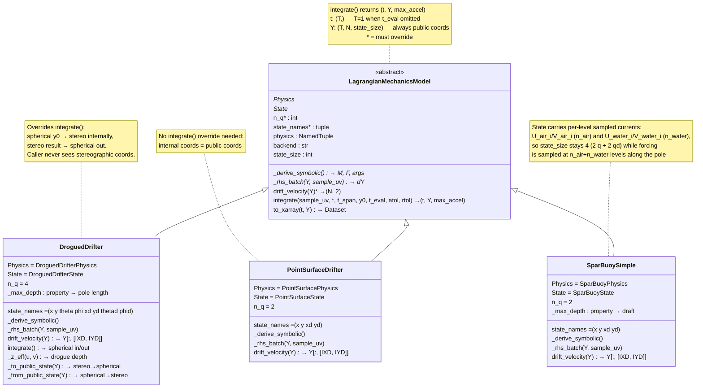
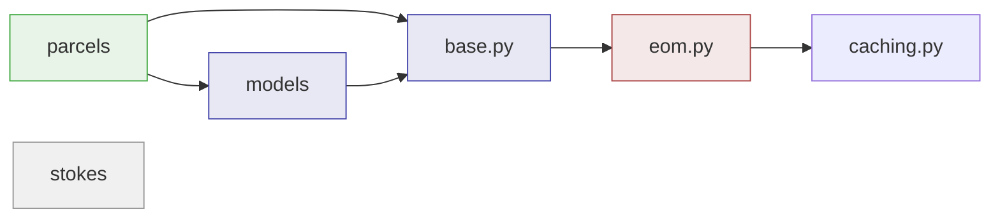

# Class diagram

Current architecture.

```mermaid
classDiagram
    direction TB

    class LagrangianMechanicsModel {
        <<abstract>>
        Physics*
        State*
        n_q* : int
        state_names* : tuple
        physics : NamedTuple
        backend : str
        state_size : int
        _derive_symbolic()* → M, F, args
        _rhs_batch(Y, sample_uv)* → dY
        drift_velocity(Y)* → (N, 2)
        integrate(sample_uv, *, t_span, y0, t_eval, atol, rtol) → (t, Y, max_accel)
        to_xarray(t, Y) → Dataset
    }
    note for LagrangianMechanicsModel "integrate() returns (t, Y, max_accel)
t: (T,) — T=1 when t_eval omitted
Y: (T, N, state_size) — always public coords
* = must override"

    class DroguedDrifter {
        Physics = DroguedDrifterPhysics
        State = DroguedDrifterState
        n_q = 4
        state_names = (x y theta phi xd yd thetad phid)
        _derive_symbolic()
        _rhs_batch(Y, sample_uv)
        drift_velocity(Y) → Y[:, [IXD, IYD]]
        integrate() → spherical in/out
        _z_eff(u, v) → drogue depth
        _max_depth : property → pole length
        _to_public_state(Y) → stereo→spherical
        _from_public_state(Y) → spherical→stereo
    }
    note for DroguedDrifter "Overrides integrate():
spherical y0 → stereo internally,
stereo result → spherical out.
Caller never sees stereographic coords."

    class PointSurfaceDrifter {
        Physics = PointSurfacePhysics
        State = PointSurfaceState
        n_q = 2
        state_names = (x y xd yd)
        _derive_symbolic()
        _rhs_batch(Y, sample_uv)
        drift_velocity(Y) → Y[:, [IXD, IYD]]
    }
    note for PointSurfaceDrifter "No integrate() override needed:
internal coords = public coords"

    class SparBuoySimple {
        Physics = SparBuoyPhysics
        State = SparBuoyState
        n_q = 2
        state_names = (x y xd yd)
        _derive_symbolic()
        _rhs_batch(Y, sample_uv)
        drift_velocity(Y) → Y[:, [IXD, IYD]]
        _max_depth : property → draft
    }
    note for SparBuoySimple "State carries per-level sampled currents:
U_air_i/V_air_i (n_air) and U_water_i/V_water_i (n_water),
so state_size stays 4 (2 q + 2 qd) while forcing
is sampled at n_air+n_water levels along the pole"

    LagrangianMechanicsModel <|-- DroguedDrifter
    LagrangianMechanicsModel <|-- PointSurfaceDrifter
    LagrangianMechanicsModel <|-- SparBuoySimple
```

## Dependency direction

```mermaid
graph LR
    parcels --> base[base.py]
    parcels --> models
    models --> base
    base --> eom[eom.py]
    eom --> caching[caching.py]

    stokes

    style stokes fill:#f0f0f0,stroke:#999
    style parcels fill:#e8f4e8,stroke:#4a4
    style base fill:#e8e8f4,stroke:#44a
    style models fill:#e8e8f4,stroke:#44a
    style eom fill:#f4e8e8,stroke:#a44
```

`parcels` depends on models and base. Models depend on base.
Base depends on eom. `stokes` is standalone. No reverse dependencies.
