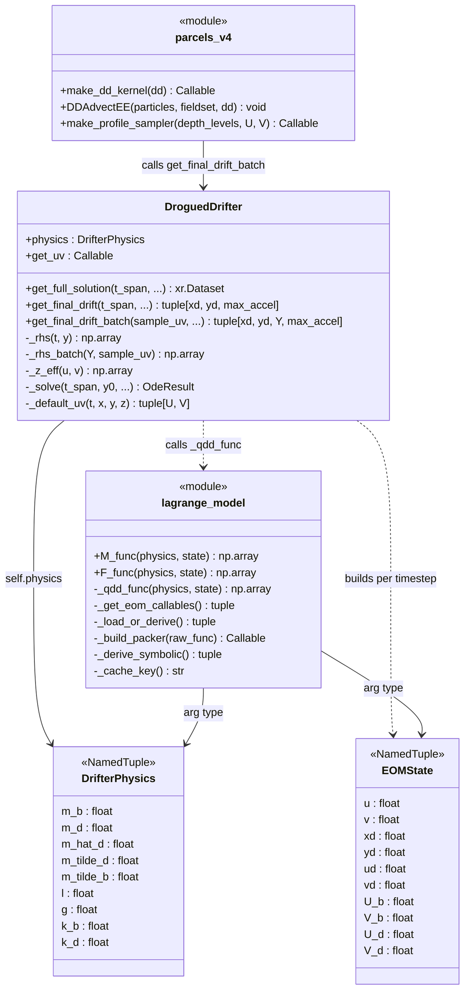
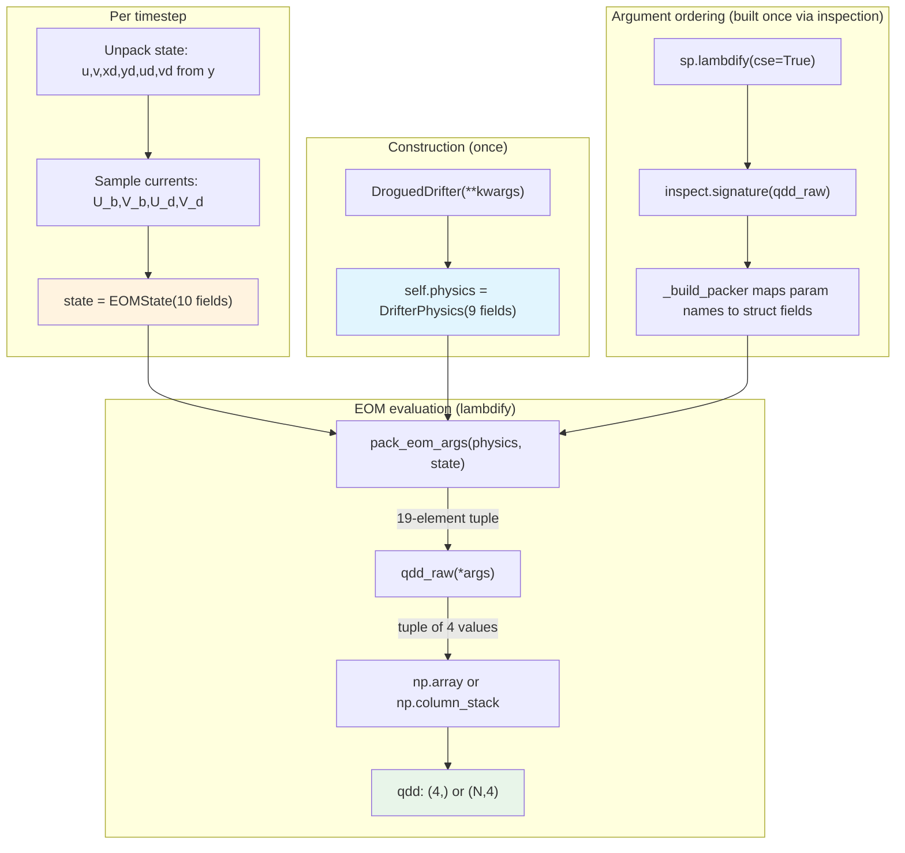
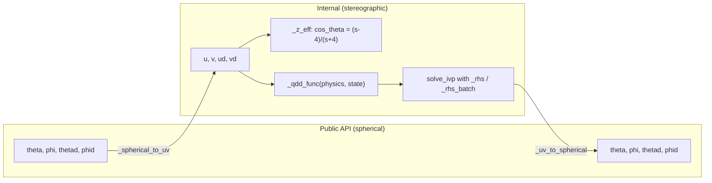
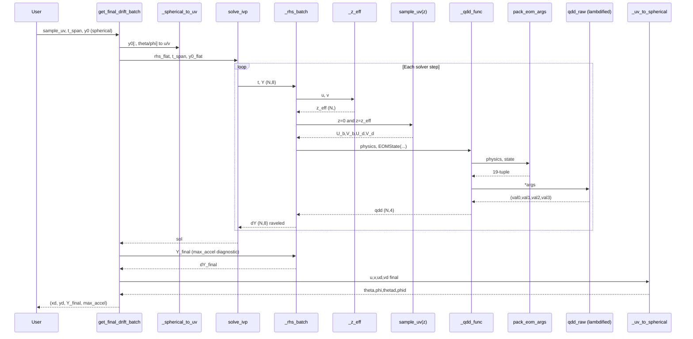
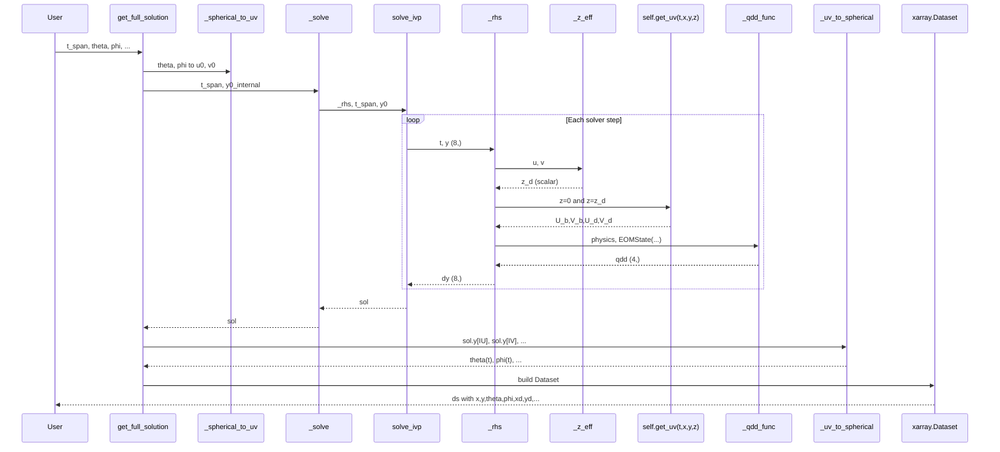
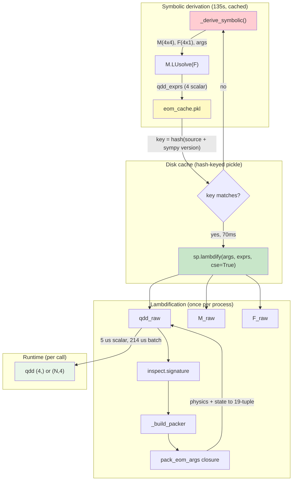

# Architecture diagrams (post DW-A through DW-F, updated for D-I)

## Class diagram

## Data flow: parameter passing and argument packing

## Coordinate boundary

## Sequence: get_final_drift_batch

## Sequence: get_full_solution (scalar)

## Caching and lambdification pipeline

